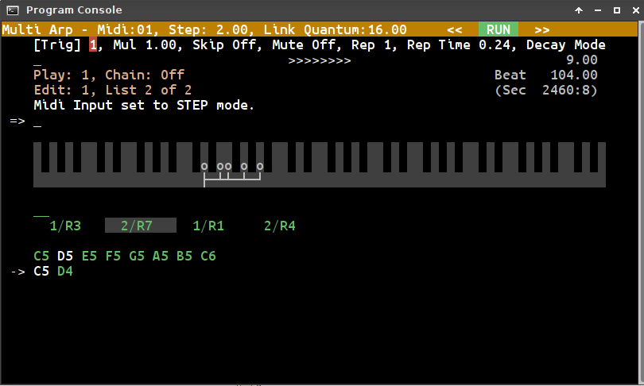

# Multi Arp
*Another step in the Great Midi Adventure!*

**BN - Dec 16, 2017**

(I’ve always thought of ‘Multi Arp’ as an interim name, but after several months now I haven’t found anything else and the search must continue.)

## What is it?

* ***Non-linear pattern sequencer*** with the focus on live exploration, improvisation and (sooner or later) performance.

* A single instance of the app plays one polyphonic pattern at a time on one midi-channel. ***Ableton Link*** is used for synchronisation and timing between multiple instances of the sequencer and, of course, other apps on the current IP LAN segment that support Link. (You do not need to have Ableton Live running or even licensed for this to work.)

## User Interface

The UI is text mode, 80 by 25 characters. This avoids the use of mouse/touch on a cramped table top or flimsy laptop stand, but also comes from a sense of nostalgia on my part - think *Voyetra Sequencer Plus* on DOS, or even *Fairlight*.

A simple horizontal ***menu*** system exists for some functionality. For everything else you have to use the ***command line*** within the app.

Pattern data is transferred in and out using ***copy***/***paste*** key combinations. There is no conventional file open/save mechanism.

## Midi Note entry

Note entry is via midi keyboard. There are two step modes and one 'looper-style' real time mode.

Creation and editing of all note data is possible from within the app, but this is only intended for small additions or minor tweaks.

## Architecture

Within the app everything runs from the UI thread using a timed render loop. Linux’ ALSA Sequencer is used for timing and event scheduling. Ableton Link is interrogated to determine when events should be scheduled.

## Platform Requirements

* Written in C++ with a few bits that look like plain old C.

* Built with gcc for Linux 64 bit (C++14, by default).
Heavy use of the C++ Standard Library, in particular string, vector and map.

* The IDE used for this source tree is CodeBlocks.

* Double precision floating point maths for Ableton Link and other parts of the sequencer (though this is problematic in areas where consistent conditional branching is required and a switch to integers in these places would be useful).

* UI uses NCurses library.

* ALSA sequencer for internal timing and midi event scheduling, receipt and delivery.

* Ableton Link for synchronization with other instances of itself, and of course other apps using Link on the current IP LAN segment.

* Linux utility *xclip* is used for copy/paste.

BN
